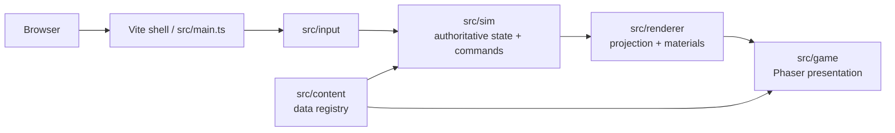

# Project Tarmin

Project Tarmin is a browser-playable first-person dungeon game for players who want a compact, deterministic descent built around grid exploration, turn-based combat, equipment choices, and consequential loot. The current MVP is an original one-floor vertical slice presented with Phaser and WebGL.

## Quickstart

### Prerequisites

- Node.js with npm available on your PATH.
- Chromium installed for browser tests. After installing dependencies, run `npx playwright install chromium` once.

### Install and run

```bash
npm install
npm run dev
```

Open the local URL printed by Vite. The game starts at a seed entry screen; seed `7391` is the documented deterministic walkthrough seed.

### Verify

```bash
npm run typecheck
npm run lint
npm test
npm run test:browser
npm run build
```

`npm run test:browser` starts the Vite server through Playwright and runs the Chromium smoke suite. It requires the Playwright browser installation above.

## Current features

- First-person pseudo-3D dungeon projection with discrete cardinal turning and grid movement.
- Seeded, deterministic simulation with canonical serializable state; authoritative simulation code does not use `Math.random()`.
- Turn-based encounters with Ashbound Wardens, Glass Mirelings, and Gloam Scavengers.
- Persistent defeated monsters and location-bound ground loot.
- Ring inventory with selection, left/right hand equipment, item use, pickup, and drop actions.
- A one-floor objective: defeat the Ashbound Warden, acquire the Star-Forged Seal, reach exit `(2,4)`, and complete the run.
- Defeat and victory terminal states, post-terminal input blocking, same-seed restart, and new-seed restart.
- Pause and reduced-motion controls, plus HUD feedback for vitality, equipment, inventory, location, turn, seed, and objective state.

## Architecture



`src/sim/` owns canonical state transitions, seeded RNG, movement, combat, inventory, loot, and run lifecycle. `src/input/` converts keyboard input into explicit gameplay commands. `src/renderer/` provides framework-independent visibility, portal, mesh, material, and entity projection helpers. `src/game/` adapts those results to Phaser and owns presentation only. `src/content/` contains item, monster, and loot definitions.

## Controls

| Action | Keys |
| --- | --- |
| Move forward/backward | `W` / `S`, or `ArrowUp` / `ArrowDown` |
| Turn left/right | `A` / `D`, or `ArrowLeft` / `ArrowRight` |
| Select previous/next ring item | `Q` / `E` |
| Equip selected item left/right | `Z` / `X` |
| Use selected item | `R` |
| Pick up loot | `P` |
| Drop selected item | `Backspace` |
| Attack with left/right hand | `Space` / `F` |
| Pause/resume | `Escape` |
| Retreat from an encounter | `X` |

## Directory structure

```text
src/
  sim/          Pure authoritative state, RNG, commands, and gameplay tests
  content/      Data-driven item, monster, and loot registries
  input/        Keyboard bindings and input-mode controller
  renderer/     Framework-independent dungeon and entity projections
  game/         Phaser scene and browser presentation adapter
tests/browser/ Playwright Chromium flows and visual-state checks
docs/           Vision, design, architecture, testing, and phase specifications
harness/        Acceptance records, build history, context, and evidence
public/assets/  Original project presentation assets used by the browser build
scripts/        Repository checks and acceptance-status tooling
```

## Developer command center

| Command | Purpose |
| --- | --- |
| `npm run dev` | Start the Vite development server. |
| `npm run build` | Type-check the project and create the Vite production build in `dist/`. |
| `npm run typecheck` | Run the TypeScript project build without emitting application output. |
| `npm run lint` | Run the repository's current TypeScript-based lint/check script. |
| `npm test` | Run the Vitest unit and simulation suite. |
| `npm run test:browser` | Run the Playwright Chromium browser suite. |
| `npm run check:acceptance` | Check acceptance-document status formatting. |

Useful browser fixtures include `/?fixture=combat-defeat`, `/?fixture=defeated`, `/?fixture=victorious`, `/?fixture=straight-corridor`, `/?fixture=closed-door`, and `/?fixture=left-opening-1`. They are deterministic review and acceptance routes, not separate game modes.

## Testing and verification

The unit/simulation suite covers seeded command equality, canonical state transitions, combat and inventory, content validation, dungeon-world persistence, and renderer-neutral projection helpers. The browser suite covers the complete seed `7391` floor route, combat defeat and restart, visible entities, terminal states, architectural openings/blockers, pause, reduced motion, supported desktop viewports, and application/page error collection.

For rendering or interaction changes, run `npm run dev` and review the affected flow in Chromium at the documented 1280×720, 1600×900, and 1920×1080 viewports. Automated browser tests establish functional behavior; visual and atmosphere claims require runtime inspection and evidence in `harness/`.

## Configuration

No required environment variables or safe `.env.example` file were found. The browser shell uses a default seed of `7391`; users can enter a numeric or textual seed or generate one through the start screen. Playwright's local server settings are defined in `playwright.config.ts`.

## Troubleshooting

| Symptom | Likely cause | Fix |
| --- | --- | --- |
| `npm run test:browser` cannot launch Chromium | Playwright's browser binary is not installed | Run `npx playwright install chromium`, then rerun the test. |
| Browser tests fail to connect to `127.0.0.1:4173` | The Vite web server did not start or the port is occupied | Stop the process using port `4173`, then rerun `npm run test:browser`; Playwright starts the server itself. |
| The game is blank or has a startup error | Dependencies are missing or the browser lacks WebGL support | Run `npm install`, use a current Chromium-based browser, and confirm WebGL is enabled. |
| A test route shows the wrong state | A fixture query string is misspelled or omitted | Use the exact fixture names listed in the Developer command center; normal play starts from `/`. |
| Build output includes a Phaser chunk-size warning | Phaser is intentionally kept in a vendor chunk by `vite.config.ts` | Treat the warning as informational unless the build exits non-zero. |

## Stack inventory

| Layer | Technology | Version | Source | Notes |
| --- | --- | --- | --- | --- |
| Language | TypeScript | `^5.7.2` | `package.json` | Authoritative simulation and browser code |
| Build/dev server | Vite | `^6.0.7` | `package.json` | Browser development and production build |
| Game framework | Phaser | `4.2.1` | `package.json` | WebGL presentation layer |
| Unit testing | Vitest | `^2.1.8` | `package.json` | Simulation and renderer-neutral tests |
| Browser testing | Playwright Test | `^1.63.0` | `package.json` | Chromium acceptance flows |
| Package manager | npm | lockfile v3 | `package-lock.json` | Lockfile-backed installs |

## Reproducibility and maintenance

Use the committed `package-lock.json` with `npm install`. Pin a seed when reproducing gameplay behavior; the tests and acceptance records commonly use seed `7391`. Keep authoritative changes in `src/sim/`, keep Phaser-specific behavior in `src/game/`, and update the owning document under `docs/` when a contract changes. Record material implementation and browser evidence in `harness/build-log.md`.

The MVP stores one versioned checkpoint in browser `localStorage`, autosaved after each playing command. Continue resumes that checkpoint after a reload; defeat and victory clear it, so the checkpoint bridges sessions without undoing a run.

## Project direction

The implemented MVP is intentionally narrower than the broader project documents. `docs/PLANS.md` identifies procedural maze generation, expanded content, additional floors, audio, and release preparation as later slices; those are not claims about the current build. The working title remains an internal codename, and the public-facing name and legal review are still open per `docs/IP_AND_BRANDING.md`.

## Contributing and governance

Contribution guidelines are not yet formalized. Please open an issue before large changes and follow the repository instructions in `AGENTS.md` and the applicable documents under `docs/`.

| Area | Status |
| --- | --- |
| Engineering rules | `AGENTS.md` |
| Architecture and design contracts | `docs/ARCHITECTURE.md`, `docs/DESIGN.md`, and related `docs/` specifications |
| Testing requirements | `docs/TESTING_STRATEGY.md` and `docs/DEFINITION_OF_DONE.md` |
| Security policy | No `SECURITY.md` file was found. **[TBD]** |
| Code of Conduct | No `CODE_OF_CONDUCT.md` file was found. **[TBD]** |
| Maintainers/support | No maintainer or support policy was found. **[TBD]** |

## License

No root license file was found. Add a license before publishing or accepting external contributions. Asset provenance and intellectual-property constraints are documented in `docs/IP_AND_BRANDING.md` and `docs/ASSET_SOURCE_WORKFLOW.md`.
